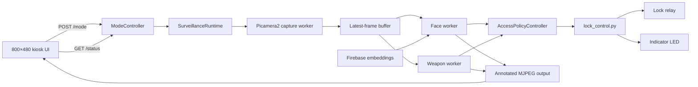
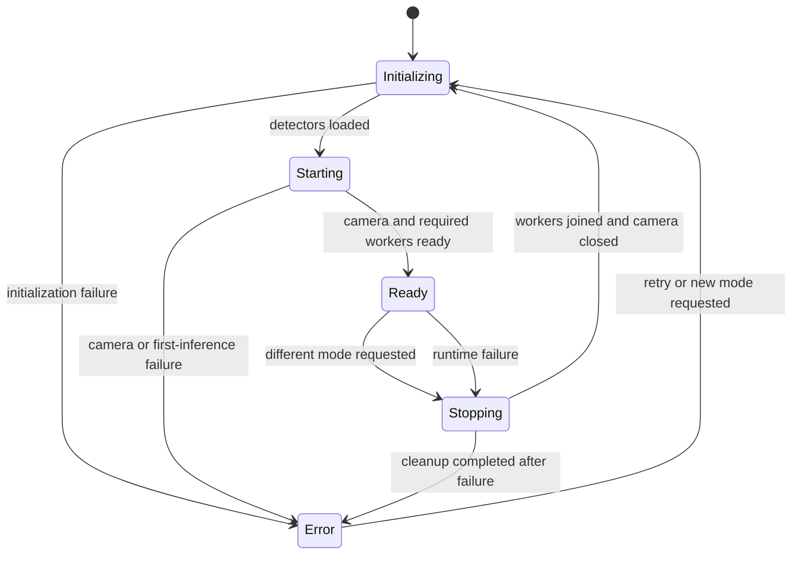

# Surveillance_system_IERD
This is a surveillance system project for IERD, BCSIR. The programs are written in python 3.11.2 for raspberry pi 5.

If you want to replicate the work, ensure you have **libcamera** and **venv** package installed in the system. First, create a virtual environment with access to system packages:

    python3.11 -m venv venv --system-site-packages

Then activate the venv:

    source venv/bin/activate

Finally install the dependencies:

    pip install -r requirements.txt

Update the codes to include your Firebase credentials and database url.

That's it. You should be good to run the scripts. Details are provided in the code should you require.

## What this project does

This repository contains a Raspberry Pi–based surveillance prototype that combines:

- Real‑time weapon/object detection using a TensorFlow Lite YOLOv5 model
- Real‑time face recognition powered by the `face_recognition` (dlib) library
- Cloud‑backed identity storage with Firebase Realtime Database

The system is designed for on‑device inference on a Raspberry Pi 5 (ARM64), using the official Raspberry Pi Camera via the modern libcamera/PiCamera2 stack.

## Hardware and OS requirements

- Raspberry Pi 5 running 64-bit Raspberry Pi OS with libcamera/Picamera2
- Raspberry Pi Camera Module or compatible Picamera2 device
- Waveshare 7-inch 800×480 HDMI touchscreen
- GPIO-controlled lock relay or driver circuit
- Lock-state indicator LED
- Network connectivity for Firebase face embeddings

GPIO uses BCM numbering. The defaults are BCM 23 for the active-low lock output
and BCM 24 for the indicator LED. The LED is illuminated while the commanded
lock state is closed. A relay or suitable driver must isolate the Raspberry Pi
from the lock's power circuit.

## System design

The application uses one camera owner, a serialized mode controller, independent
inference workers, and one access-policy controller. Detection workers never
write directly to GPIO. They publish observations to the access policy, which is
the only component allowed to request a lock-state change.

### Runtime components

| Component | Responsibility |
|---|---|
| `web_ui.py` | Flask routes, MJPEG response, status API, mode-selection API, and recording API |
| `ModeController` | Serializes mode changes and prevents concurrent camera owners |
| `SurveillanceRuntime` | Owns Picamera2, frame publication, inference workers, annotations, and metrics |
| `raw_recording.py` | Handles Raw Feed recording, temporary takes, save, and retake |
| `FaceDetector` | Matches faces against Firebase embeddings and produces named detections |
| `WeaponDetector` | Runs YOLOv5 TFLite inference and produces class/confidence detections |
| `AccessPolicyController` | Fuses face and weapon observations into lock decisions |
| `lock_control.py` | Drives the configured lock and LED pins and records commanded state |
| `system_config.yaml` | Defines camera, detector, timing, model, and GPIO policy values |

The camera worker assigns a monotonically increasing sequence number to each
frame. Inference workers wait for a newer sequence and therefore do not process
the same frame repeatedly. Full System mode runs face and weapon inference
independently so a slow model does not block camera capture or the other worker.

### Operating modes

| Mode | Camera | Face inference | Weapon inference | Lock behavior |
|---|---:|---:|---:|---|
| Raw Feed | Yes | No | No | Preserves the current command |
| Face Recognition | Yes | Yes | No | Diagnostic only; cannot unlock |
| Weapon Detection | Yes | No | Yes | Can lock on pistol or knife; cannot unlock |
| Full System | Yes | Yes | Yes | Can grant timed face access; weapons override immediately |

The configured mode is not marked ready until its camera is producing frames and
every required inference worker has completed at least one successful pass.

## Touchscreen UI and recording

The UI fits an 800×480 display, keeps inference metrics in a bottom strip,
and shows the full camera frame without cropping.

In **Raw Feed** mode, the Live Detections box provides recording controls:

1. **START RECORDING** begins a video without audio.
2. **STOP RECORDING** ends the take without saving it permanently.
3. **SAVE** keeps a timestamped H.264 MP4 in `/home/ierd/recorded_data/`.
   **RETAKE** discards the take and starts a new recording.

The directory is created automatically. Leaving Raw Feed or shutting down
normally discards unsaved takes. Recording controls appear only in Raw Feed;
other modes keep their existing behavior.

Recording requires FFmpeg and FFprobe (`sudo apt install ffmpeg`). A dedicated
recording worker keeps FFmpeg running after browser requests finish. Recording
errors appear in the box and server terminal.

After backend code changes, restart `python web_ui.py` and refresh the browser.

## Mode-controller finite-state machine

Only one transition may execute at a time. During a transition, the access
policy is placed in a non-unlocking transition mode. The old workers are
signalled, joined, and the camera is closed before the next runtime opens it. If
a worker cannot stop safely, the next mode is not started.

## Access-control finite-state machine

The access policy starts fail-secure with a commanded closed lock. All enrolled
Firebase identities are currently treated as authorized identities.

```mermaid
stateDiagram-v2
    [*] --> Locked: fail-secure startup
    Locked --> FacePending: recognized face in Full System
    FacePending --> Unlocked: required confirmations and fresh safe weapon scan
    FacePending --> Locked: confirmation expires
    Unlocked --> Locked: access window expires
    Locked --> WeaponHold: pistol or knife detected
    FacePending --> WeaponHold: pistol or knife detected
    Unlocked --> WeaponHold: pistol or knife detected
    WeaponHold --> Locked: hold expires; fresh face required
    Locked --> Fault: camera, inference, or GPIO failure
    FacePending --> Fault: camera, inference, or GPIO failure
    Unlocked --> Fault: camera, inference, or GPIO failure
    WeaponHold --> Fault: camera, inference, or GPIO failure
    Fault --> Locked: healthy runtime successfully replaces faulted runtime
```

### Access rules and timing

- A face must be recognized twice within the configured three-second
  confirmation window.
- Full System must also have a non-stale weapon scan before access is granted.
- A successful authorization opens the lock for five seconds.
- The same continuously visible face cannot repeatedly reopen the lock. Face
  authorization rearms after the face has been absent for two seconds.
- A pistol or knife observation closes the lock immediately from any access
  state and refreshes a ten-second weapon hold.
- When the weapon hold expires, the system remains closed and requires a new
  face authorization.
- Camera, worker, model, or GPIO failures command the lock closed.
- Mode changes do not create a second camera owner or allow a starting face-only
  pipeline to inherit Full System's unlock permission.

## State reporting

`/status` exposes the active/requested mode, transition state, capture FPS,
inference timings, current detections, access-policy state, reason, countdown,
GPIO availability, configured pins, and commanded lock state.

The UI represents access state as:

| Policy state | UI meaning |
|---|---|
| `locked` | `CLOSED` |
| `face_pending` | `CLOSED · VERIFYING` |
| `unlocked` | `OPEN` |
| `weapon_hold` | `CLOSED · ALERT` |
| `fault` | `CLOSED · FAULT` |

The displayed value is the state commanded by software. Confirming that the
physical mechanism actually moved requires a separate lock-position sensor.
